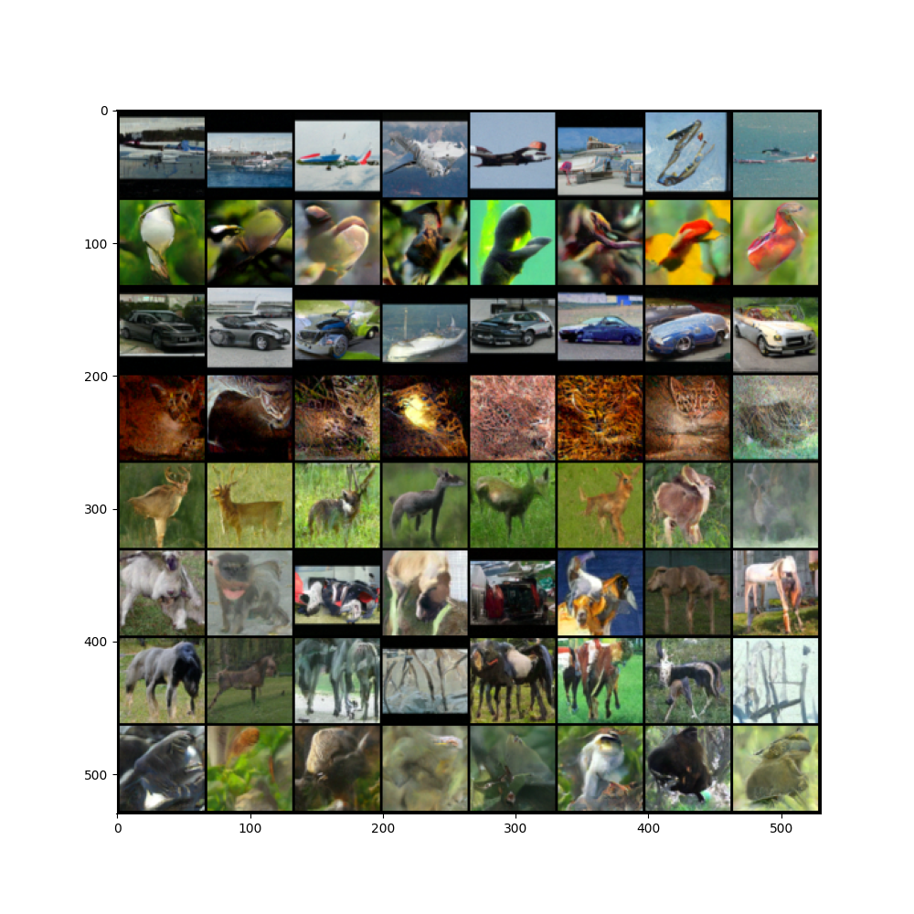
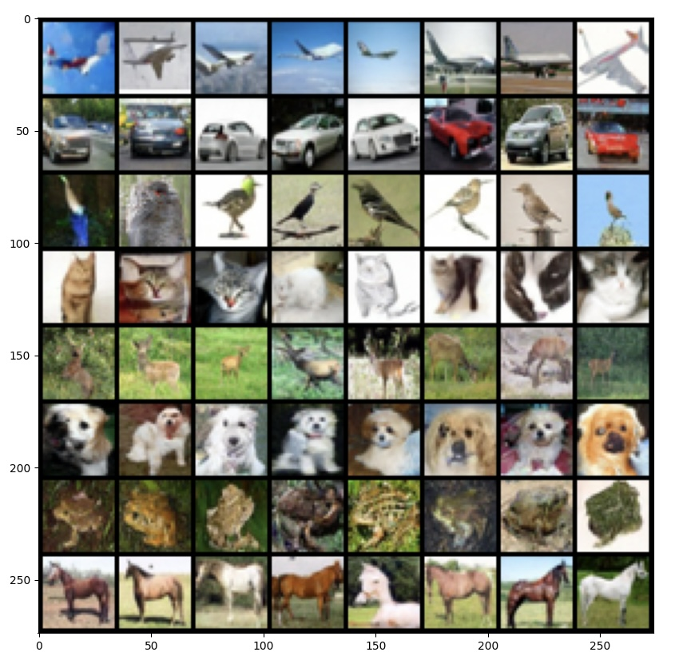
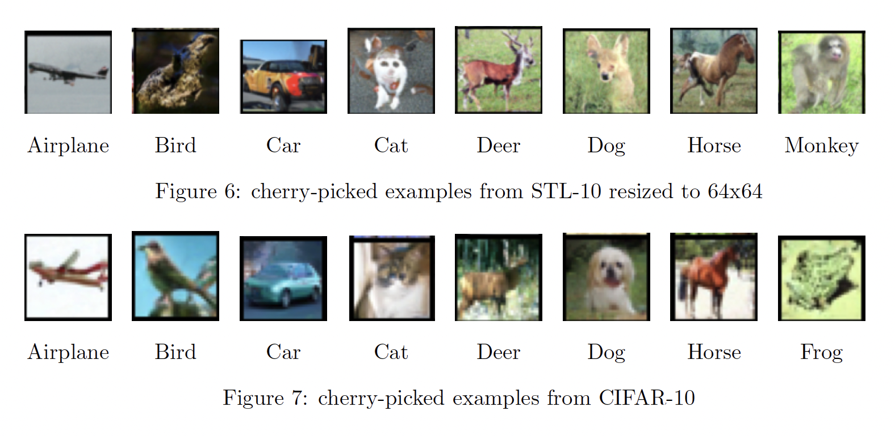

# 🤖 IMAGE GENERATION USING Denoising Diffusion Probability Model With learning rate warm-up and classifier-free guidance

## 🚀 Introduction

Image generation model via DDPM model on STL-10 and CIFAR-10 datasets

## 📜 Abstract from the Paper

> _"This paper proposes using a Denoising Diffusion Probability Model (DDPM) with learning rate warm-up and classifier-free guidance for image generation on CIFAR-10 and STL-10. The results demonstrate realistic and high-quality output, although hardware limitations made producing high-resolution images on the STL-10 dataset challenging. And the Future work could involve implementing the improved Denoising Diffusion Implicit Model (DDIM) to reduce the processing time and investing in a more advanced and stable hardware environment."_ 

## 🏆 Achievements & Visual Showcase

### Generated Images: STL-10 Dataset



### Generated Images: CIFAR-10 Dataset



### Premium Selections: Cherry-pick of Both



## 🛠 Installation and Usage

### Prerequisites
Ensure the availability of the following before proceeding:

- Python 3.x

### Get Started
Execute the following commands in your terminal to set up and run the project:

```bash
git clone [repository_url]
cd Image-generation-ddpm
